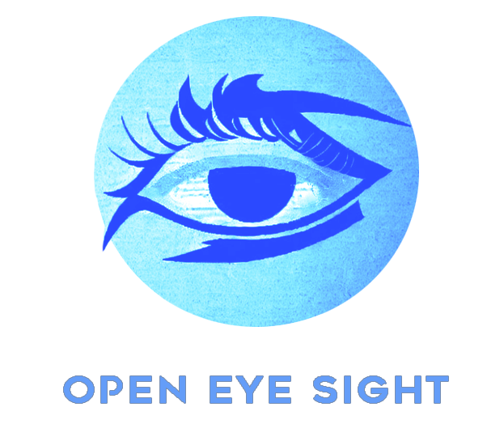

<p align="center">
    
</p>
<div align="center">
    <a href="https://github.com/experiments-lain/Open-Eye-Sight/stargazers"></a>
   
</div>

## Open-Eye-Sight: Multi-Camera and Video Perception

I design and implement **Open-Eye-Sight**, an initiative dedicated to **efficiently** run search entities and events on the video by textual description/image. 
Open-Eye-Sight aims to provide open-source solution for multi-camera semantic and image search problem and try out the capabilities of 
modern vision models. My method is capable of finding the objects and events over custom time interval on the video/multi-camera stream by using textual description or target image.

## 📰 News

- **[2024.09.04]** The first implementation released.
  [[Technical Report]]()

## 🎥 Demo

<style>
  .fast-gif {
    width: 640px;
    height: 360px;
    animation-duration: 0.5s;
    animation-timing-function: steps(8, end);
    animation-iteration-count: infinite;
  }
</style>

<p align="center">
  
</p>

## 🔆 New Features/Updates


### TODO list sorted by priority

<details>
<summary>View more</summary>

- [x] Asynchronized processing pipeline from multiple EarthCam Videos/Streams

- [x] Connect non-relational database to BucketManagerV2

</details>

## Contents

- [Installation](#installation)
- [Search](#search)
- [Evaluation](#evaluation)
- [Acknowledgement](#acknowledgement)

Other useful documents and links are listed below.

- Technical Reports:
  - [report 1.0](docs/report_01.md): architecture, data, etc.
- Repo structure: [structure.md](TODO)
- Config file explanation: [config.md](TODO)
- Evaluation: [eval/README.md](TODO)

## Installation

### Install from Source

For CUDA 12.1, you can install the dependencies with the following commands. Otherwise, please refer to [TODO](TODO) for more instructions on different cuda version, and additional dependency.

```bash
# create a virtual env and activate (conda as an example)
conda create -n camera_search python=3.12.4
conda activate camera_search

# download the repo
git clone https://github.com/experiments-lain/Open-Eye-Sight
cd Open-Eye-Sight

# install required libraries (torch, torchvision, ultralytics and xformers)
pip install -r requirements/requirements.txt # TODO TODO TODO
```

### Use Docker

TODO

## Search 

### Command Line Search

TODO


## Evaluation

TODO

## Acknowledgement

TODO

- [CLIP](https://github.com/openai/CLIP): A powerful text-image embedding model.


