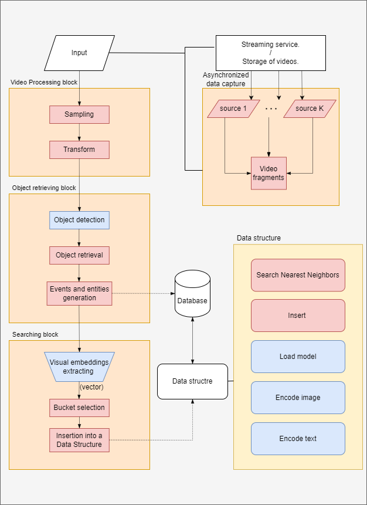

# Open-Eye-Sight Report 1.0: System Baseline

This report describes our first attempt to use AI powered algorithms in the search in video tasks. This report more concentrated on engineering part, because on early stages without any baselines it's hard to optimize&improve current algorithms.

## System Architecture

The initial implementation focused on establishing a robust foundation for future development and creating an effective evaluation framework. This approach aimed to set a reliable baseline and benchmark for subsequent iterations and ensure a comprehensive assessment process for the system's performance.

    

Figure 1: High-level architecture of the system.

The provided system architecture diagram illustrates a system comprising three core modules: Video Processor, Entity & Event Retriever, and Search Manager. The diagram also includes additional information on input receiving, data structure, and database for clarity.

The system's entry point is the asynchronous input receiver, which receives video data from multiple sources, such as online streams and videos in storage. The received data is then transmitted to the Video Processor, where it is sampled and transformed into individual frames for further processing. Next, the data is sent to the Entity & Event Retriever, which extracts entities and events from each frame. The images of these retrieved entities and events are saved. The next component Search Manager is responsible for extracting visual embeddings from the received entities and events. These visual embeddings are then stored in the data structure, which enables the system to respond to search queries using K-Nearest Neighbors (KNN) vector search. 

In v1.0 implementation the database and data asynchronous reading is still not **supported**.

The modular design of the system ensures flexibility, reliability, and adaptability to future changes. A more detailed review of the system's components will highlight its adaptability.

### Get video from streams/videos

To process video streams efficiently, we sample every k-th frame from the received videos. This approach allows us to reduce the amount of data to be processed while still capturing the essence of the video content. 

To avoid input delays, we will use asynchronous processing to handle multiple video sources concurrently.

### Video Processing

At the video processing stage, we transform the sampled frames to prepare them for the object retrieval. We optimize the sampling rate to match the video's frames per second (FPS) to reduce computational resources. Such choise of the sampling rate is optimal for now due to the duration of the inserting process overall. We are compressing to the format 640x640 to use YOLO later. 

### Entity & Event Retrieving

Using YOLO (You Only Look Once), we detect objects within each frame and extract them as separate images. We assign a unique ID to each object and store them for future usage. Additionally, we can enable event retrieval, which involves identifying events where multiple objects interact. We achieve this by selecting the bounding box that contains all participating objects.

The idea is simple for particular event on the picture several entities must necessarily participate in it, so for each pair of entities select the box that contains both of them and add them too, such action will allow us to find events on the video. Obviously the idea is not too clever, but for the baseline it's good enough. 

### Search Manager
The search manager is responsible for organizing objects into buckets and extracting visual embeddings and text embeddings. The system has a pluggable image encoding model system that allows easy integration of various image encoding models. Currently, we support DINOv2 and Open CLIP models. But other model can easily be integrated into the systme, for that you need to inherite the bucket class and implement load_model, encode_image and encode_text for it.

## Searching approach

To search for objects, we employ a linear search method to find the nearest vector in the embedding space to the target vector. We use cosine similarity to measure the similarity between visual embeddings, which allows us to determine whether an object is a suitable match or not. We chose DINOv2 and CLIP models due to their good performance in object re-identification [benchmark]((https://arxiv.org/pdf/2311.00750)). 

## Postscript

The current implementation doesn't support important features, and the evaluation pipeline is still under development. In future versions, we plan to implement connection with database, asynchronous data loading from multiple sources, and a comprehensive evaluation pipeline. Additionally, we will create automated tests to ensure the system's proper functioning.

Once the features mentioned above have been implemented, we will have a robust working baseline that will enable us to conduct more research on object search in videos task. 

That's all for now. We would greatly appreciate if you could star my project.

